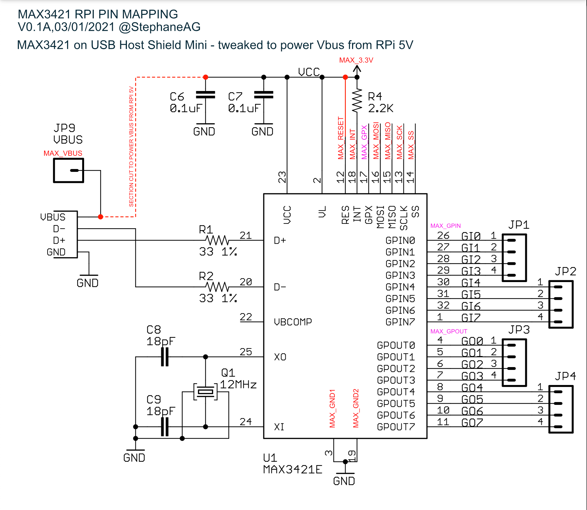
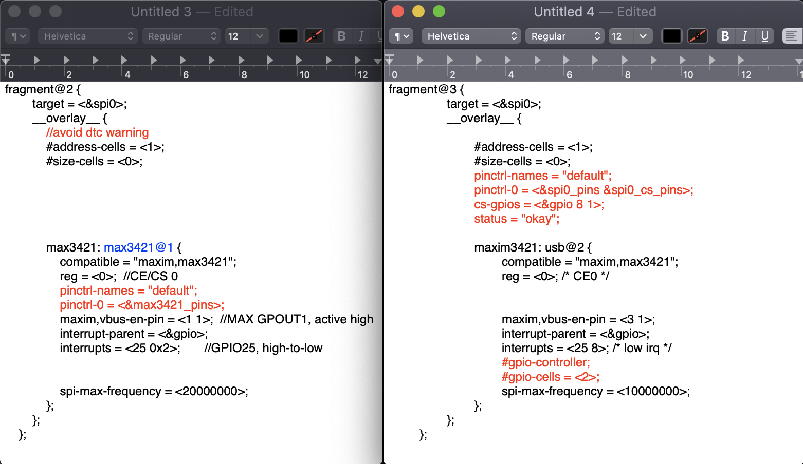

### R: the present reminder is on how to add an additional "USB Host" port on a RPI via some of its SPI GPIOs ( and while its "data" native Mini-USB port is acting either as slave/host/otg )

#### Sources 
##### USB Host Shield part:
- USB Host Shiled Mini tweak to power Vbus with RAW/5V: https://diyelectromusic.wordpress.com/2020/08/01/mini-usb-midi-to-midi/
- USB Host Shield Project "main" official page: https://chome.nerpa.tech/arduino_usb_host_shield_projects/
- USB Host SHield Documentation: https://chome.nerpa.tech/downloads/#Arduino_USB_Host_Shield_Documentation
- USB Host Shield Hardware Manual: https://chome.nerpa.tech/usb-host-shield-hardware-manual/
- USB Host Shield 5V Version: https://chome.nerpa.tech/wp/wp-content/uploads/2011/02/uhs20s_pin_layout.jpg
- USB Host Shield 3V Version ( discontinued cuz 5V version ok at 3.3V ): https://chome.nerpa.tech/wp/wp-content/uploads/2011/02/uhs20_3v3_differences.jpg
- USB Host Shield Mini Schematic: https://chome.nerpa.tech/chome_downloads/UHS_mini_10.pdf
- Arduino Pro Mini Shcematic ( as a reminder ): https://www.arduino.cc/en/uploads/Main/Arduino-Pro-Mini-schematic.pdf
- RaspberryPi SPI interface GPIO pins: https://fr.pinout.xyz/pinout/spi
##### Device Tree & driver part:
- example of an overlay: https://github.com/raspberrypi/linux/issues/848
- Raspdancer project: https://saturn.ffzg.hr/rot13/index.cgi?action=display_html;page_name=raspdancer
- interesting question on S.O: https://stackoverflow.com/questions/46539478/built-in-kernel-driver-still-need-device-tree
- how to desactivate spidev to release SPI0 CE0 ( as a separate .dts ): https://forums.raspberrypi.com/viewtopic.php?t=151423
- Taking @Vinicius Arroyo 's .dts as new 'base': https://raspberrypi.stackexchange.com/questions/83004/usb-bridge-using-max3421
- Felow hacker who has an "out of tree module" working for its needs on BB: https://wiki.acrios.com/en/acr-other/beaglebone-max3421-hcd-usb-over-spi
- 'old' topic on getting max3421 to work with overlays on RPi that an answer pointed to the one below: https://www.techsupportforum.com/threads/usb-host-using-max3421.1227180/
- the steps I originally tried were from @emw's anwser here: https://forums.raspberrypi.com/viewtopic.php?t=201262
- from above link "kernel config": https://cateee.net/lkddb/web-lkddb/USB_MAX3421_HCD.html
- 
- USBProxy project, just in case: https://github.com/scottellis/USBProxy
- http://goodfet.sourceforge.net/hardware/facedancer11/
- https://learn.adafruit.com/hacking-the-kinect/usb-analyzer
- Infos on kernel modules ( on BB sadly ) provided by above author: http://derekmolloy.ie/writing-a-linux-kernel-module-part-1-introduction/
- Infos on device tree on RPi & in french, to change: https://www.framboise314.fr/un-point-sur-le-device-tree/#Les_Device_Tree_et_le_Raspberry_Pi
- Thomas Petazzoni's Device Tree for Dummies ( 45 pages vers ): https://events.static.linuxfound.org/sites/events/files/slides/petazzoni-device-tree-dummies.pdf
- Thomas Petazzoni's Linux Kernel Slides ( 467 pages vers ): https://bootlin.com/doc/training/linux-kernel/linux-kernel-slides.pdf
- Thomas Petazzoni's Device Tree: hardware description for everybody ! video: https://www.youtube.com/watch?v=Nz6aBffv-Ek&t=2586s
- BOOTLIN TUTORIAL ON GETTING RPI HARDWARE & OVERLAYS TO WORK TO DIGGG !!: https://bootlin.com/blog/enabling-new-hardware-on-raspberry-pi-with-device-tree-overlays/
- RPI foundation's doucmentation on RPI SPI: https://www.raspberrypi.com/documentation/computers/raspberry-pi.html#spi-overview
- Kernel.org infos on USB support: https://www.kernel.org/doc/html/latest/usb/index.html
- Thomas Petazzoni's Linux Graphics Slides ( 206 pages worth digging for dispmanx replacements ? ): https://bootlin.com/doc/training/graphics/graphics-slides.pdf
- Hisi3559 platform PCIE to USB debugging ( seems to activate some USB Host support stuff/modules ): https://www.programmersought.com/article/62544420103/
- same "USB Host stuff" as above link, maybe needed to get "native USB port-like" behavior ?: https://lxnick.wordpress.com/2018/08/17/nt98515-enable-usb/
- device tree bindings for max3421: https://www.kernel.org/doc/Documentation/devicetree/bindings/usb/maxim%2Cmax3421.txt
- VERY INTERESTING QUESTION ON HOW TO COMPILE/MOVE/LOAD A MODULE WHEN USING DEVICE TREE: https://stackoverflow.com/questions/65266176/linux-dynamic-kernel-loading-with-overloading-device-tree
- dmesg "spi-bcm2835 3f204000.spi: chipselect 0 already in use" error ( bad-yet-good sign of stuff loading ;p ): https://forums.raspberrypi.com/viewtopic.php?t=151423
R: for the above, just tweaking the .dts being used for the max3421 is enough for our present use case 
- latest "max3421-hcd.c" driver version I can find for RPi, hopefully compatible: https://github.com/raspberrypi/linux/blob/rpi-5.10.y/drivers/usb/host/max3421-hcd.c
- older version hosted of the same driver hosted at bootlin ( Thomas Petazzoni's company ): https://elixir.bootlin.com/linux/latest/source/drivers/usb/host/max3421-hcd.c
#### deprecated/outdated yet interesting links ?
- rpi-source modules examples: https://github.com/RPi-Distro/rpi-source#enc28j60-spi-ethernet-driver
- modprobe spi-config usage: https://forums.raspberrypi.com/viewtopic.php?f=44&t=57157
- https://github.com/notro/rpi-source/wiki/Examples-on-how-to-build-various-modules#spi-config
- https://bchavez.bitarmory.com/compiling-kernel-modules-for-raspberry-pi/#

## Current steps ( R: not working yet :/ .. )

### 0: mod the USB Host Shield Mini to power Vbus from 5V & use the following pins mapping from it to the RPI GPIOs
Example of modding the USB Host Shield Mini: ( Thanks to: https://diyelectromusic.wordpress.com/2020/08/01/mini-usb-midi-to-midi/ )
- https://diyelectromusic.files.wordpress.com/2020/08/usb-host-shield-mini-vbus-mod.jpg?w=431&h=239&zoom=2
- https://diyelectromusic.files.wordpress.com/2020/08/usb-host-shield-mini-vbus-mod.jpg?w=431&h=239&zoom=2
- https://chome.nerpa.tech/wp/wp-content/uploads/2011/02/uhm_5V_VBUS.jpg

Currently applied shield modding / pins mapping logic for our RPi setup:


Resulting schematic


Schematics comparison:


#### 1: check some doc on the peripheral we wish to add ( "MAXIM 3421 HCD" ):
R: from device tree bindings found at: https://www.kernel.org/doc/Documentation/devicetree/bindings/usb/maxim%2Cmax3421.txt
```
Maxim Integrated SPI-based USB 2.0 host controller MAX3421E

Required properties:
 - compatible: Should be "maxim,max3421"
 - spi-max-frequency: maximum frequency for this device must not exceed 26 MHz.
 - reg: chip select number to which this device is connected.
 - maxim,vbus-en-pin: <GPOUTx ACTIVE_LEVEL>
   GPOUTx is the number (1-8) of the GPOUT pin of MAX3421E to drive Vbus.
   ACTIVE_LEVEL is 0 or 1.
 - interrupts: the interrupt line description for the interrupt controller.
   The driver configures MAX3421E for active low level triggered interrupts,
   configure your interrupt line accordingly.

Example:

	usb@0 {
		compatible = "maxim,max3421";
		reg = <0>;
		maxim,vbus-en-pin = <3 1>;
		spi-max-frequency = <26000000>;
		interrupt-parent = <&PIC>;
		interrupts = <42>;
	};
```

#### 2: writing our .dts file ( tweaked from the original author's )
( original author:Vinicius Arroyo, source: https://raspberrypi.stackexchange.com/questions/83004/usb-bridge-using-max3421 )
```
/dts-v1/;
/plugin/;

/ {
    compatible = "brcm,bcm2835";
    /* Disable spidev for spi0.0 - release resource */
    fragment@0 {
        target = <&spi0>;
        __overlay__ {
            status = "okay";
            spidev@0{
                status = "disabled";
            };
        };
    };

    /* Set pins used (IRQ) */
    fragment@1 {
        target = <&gpio>;
        __overlay__ {
            max3421_pins: max3421_pins {
                brcm,pins = <25>;        //GPIO25
                brcm,function = <0>;    //Input
            };
        };
    };

    /* Create the MAX3421 node */
    fragment@2 {
        target = <&spi0>;
        __overlay__ {
            //avoid dtc warning 
            #address-cells = <1>;
            #size-cells = <0>;
            max3421: max3421@1 {
                reg = <1>;  //CS 1
                spi-max-frequency = <20000000>;
                compatible = "maxim,max3421";
                pinctrl-names = "default";
                pinctrl-0 = <&max3421_pins>;
                interrupt-parent = <&gpio>;
                interrupts = <25 0x2>;       //GPIO25, high-to-low
                maxim,vbus-en-pin = <1 1>;  //MAX GPOUT1, active high
            };
        };
    };

    __overrides__ {
        spimaxfrequency = <&max3421>,"spi-max-frequency:0";
        interrupt = <&max3421_pins>,"brcm,pins:0",<&max3421>,"interrupts:0";
        vbus-en-pin = <&max3421>,"maxim,vbus-en-pin:0";
        vbus-en-level = <&max3421>,"maxim,vbus-en-pin:4";
    };
};
```

#### 3: steps originally taken & fixing our driver trouble ( info based on .dts original author's stack overflow answer )
##### A: "steps originally taken":
( original author:Vinicius Arroyo, source: https://raspberrypi.stackexchange.com/questions/83004/usb-bridge-using-max3421 )
Quote:
- ".. driver in the 4.14 kernel that doesn't support device tree.."
- ".. updated the max3421-hcd.c file with the most recent version (from 4.16) and used a custom DTS file .."
- ".. when nothing appears in dmesg, it is because the driver hasn't been matched when probing .."
- ".. try taking a look at the running device tree (dtc -I fs /proc/device-tree) to verify if the overlay is active .."

From other source ( https://stackoverflow.com/questions/65266176/linux-dynamic-kernel-loading-with-overloading-device-tree ),
I'm not sure how I should load the driver & if I should even do so or if the device tree bindings should take care of that ..

The "original steps taken" were related to the following: https://forums.raspberrypi.com/viewtopic.php?t=201262,
and @cyclicredundancy where asking questions that I also have:
- figure out if a driver is supported in Raspbian running kernel version <some version> ?
- will the driver be compiled as a module?
- tried a grep could not locate it in /lib/modules , meaning it is not compiled by default? ( ```$ find /lib/modules/ | grep hcd``` )

From the same RPI forums topic:
- check the kernel config, which is now held in a module, so you need to load that first, then check the config file.
  ```
  $ sudo modprobe configs
  $ zgrep MAX3421 /proc/config.gz 
  # CONFIG_USB_MAX3421_HCD is not set --> for @rpdom on kernel 4.9.35-v7+
  ```

Start of the "steps taken originally":
```
#  "Note this was originally done with the 4.14 kernel and should be updated for newer versions"
sudo wget https://raw.githubusercontent.com/notro/rpi-source/master/rpi-source -O /usr/bin/rpi-source && sudo chmod +x /usr/bin/rpi-source && /usr/bin/rpi-source -q --tag-update
sudo apt-get install bc libncurses5-dev bison flex libssl-dev
rpi-source
```

Quote "back porting is not required for kernel 4.19":
```
cd linux/drivers/usb/host/
mv max3421-hcd.c max3421-hcd.c.old
# The next line gets the new version of max3421-hcd.c with device tree support
wget https://raw.githubusercontent.com/torvalds/linux/5fd54ace4721fc5ce2bb5aef6318fcf17f421460/drivers/usb/host/max3421-hcd.c
```
  
Start of the "steps taken originally" - continued:
```
cd ~/linux
make menuconfig # set <M> MAX3421 HCD (USB-over-SPI) support ( in Device Drivers ->  USB support -> scroll to it & press ‘M’ to set it )
scripts/diffconfig # should respond with 'USB_MAX3421_HCD n -> m'
grep MAX3421 .config # should respond with 'CONFIG_USB_MAX3421_HCD=m'

make prepare
make SUBDIRS=drivers/usb/host/ modules
sudo make SUBDIRS=drivers/usb/host/ modules_install # may create warning

sudo depmod
```
  
Part creating the overlay ( in the "steps taken originally" only ):
```
cd ~/linux/arch/arm/boot/dts/overlays/
touch ./max3421-spi0-overlay.dts # create the file max3421-spi0-overlay.dts
cat << EOF >> ./max3421-spi0-overlay.dts
/dts-v1/;
/plugin/;
 
/ {
         compatible = "brcm,bcm2835", "brcm,bcm2708", "brcm,bcm2709";
 
         fragment@0 {
         target = <&spidev0>;
                 __overlay__ {
                         status = "disabled";
                 };
         };
 
         /* the interrupt pin of the usb-controller */
         fragment@2 {
                 target = <&gpio>;
                 __overlay__ {
                         usb2_pins: usb2_pins {
                                 brcm,pins = <25>;
                                 brcm,function = <0>; /* input */
                         };
                 };
         };
 
 
         fragment@3 {
                 target = <&spi0>;
                 __overlay__ {
 
                         #address-cells = <1>;
                         #size-cells = <0>;
                         pinctrl-names = "default";
                         pinctrl-0 = <&spi0_pins &spi0_cs_pins>;
                         cs-gpios = <&gpio 8 1>;
                         status = "okay";
 
                         maxim3421: usb@2 {
                                 compatible = "maxim,max3421";
                                 reg = <0>; /* CE0 */
                                 maxim,vbus-en-pin = <3 1>;
                                 interrupt-parent = <&gpio>;
                                 interrupts = <25 8>; /* low irq */
                                 #gpio-controller;
                                 #gpio-cells = <2>;
                                 spi-max-frequency = <10000000>;
                         };
                 };
         };
 
};
EOF

sudo dtc -@ -I dts -O dtb -o /boot/overlays/max3421-spi0.dtbo max3421-spi0-overlay.dts
# this will include 3 warnings '/boot/overlays/max3421-spi0.dtbo: Warning (unit_address_vs_reg): Node /fragment@0 has a unit name, but no reg property'
```

/boot/config.txt part ( of the "steps originally taken" ):
```
sudo nano /boot/config.txt
dtparam=spi=on # uncomment if commented out
dtoverlay=max3421-spi0 # add
dtoverlay=dwc2 # add if not present already
```

Then reboot

R: the configuration used by &emw slightly differs from mine:
- shield he used ( Sparkfun's version of the USB Host Shield ) while I use the USB Host Shield Mini: https://www.sparkfun.com/products/9947
- his "pin mapping" to the RPi is the same except for the following pins:
  - +3.3V is left unconnected
  - RST is left unconnected
  - he mods the board via a jumper from +5V to +term of tantalum capacitor beside USB connector
    ( So, I guess datasheet study to understand if my mod's actually ok for RPi ? )
  - result: Rpi +5V goes to +5V pin on sparkfun's board & the mod above feeds this to the input of the 3.3V regulator
  - the pin2 of the max3421 ( VL-, which sets the logic [1,4..3,6]V ) is connected to 3.3V
  - the Sparkfun's board ( & also the Mini ) have both 2.2k on the interrupt ( pull-up from 3.3V )
  
After above steps, @metronom had partial success ( so better than me :/ .. ): any peripheral connected to the port interfaced by MAX3421E gets recognized, but is unusable
Ex: connecting a simple thumb drive, it gets listed in lsusb. But it is unmounteable.
dmesg tells me the following: ( see https://forums.raspberrypi.com/viewtopic.php?t=201262#p1649399 )
the corresponding file in /dev/ gets created (e.g. /dev/sda in case of thumb drive). But no device I have tried has been actually functional
Long story short, getting
```
[ 70.969426] usb 2-1-port4: cannot reset (err = -110)
[ 70.969444] usb 2-1-port4: Cannot enable. Maybe the USB cable is bad?
```
@emw was using following config:
- 1) not using a USB hub
- 2) I was only using a Full speed usb device (not high speed as your logs indicated above)
- 3) I was probably using an older kernel than you 4.14 or 4.19
- 4) Also I was using it with USBProxy, buy i don't think that should make any difference.
- 5) Somewhat short wires for MOSI/MISO/,especially SCLK

@metronom has the GPIO25 interrupt receiving 0 by default, odd seeing how the max3421 works with active low interrupts
@Rivelino has it working
@emw posts last, about USBProxy, which requires host & an otg to work ( so it's indeed compatible :p ): https://forums.raspberrypi.com/viewtopic.php?t=201262#p1704365
  
##### B: fixing our driver trouble ( wip :| .. ):
R: extracts from laptop /RpiZero_usbHost_CJDrtLink/wipTefReferenceDocs_usbGadgetCompositeVolumeLabelAndRekordboxStuff.rtf
```
# replace 4.14+ version with 4.10 one for 'max3421-hcd.c'
cd ~/linux/drivers/usb/host/
mv max3421-hcd.c max3421-hcd_old.c
wget https://raw.githubusercontent.com/raspberrypi/linux/rpi-5.10.y/drivers/usb/host/max3421-hcd.c
# R: differs from @emw's url for 'back porting' ( < 4.19 ): wget https://raw.githubusercontent.com/torvalds/linux/5fd54ace4721fc5ce2bb5aef6318fcf17f421460/drivers/usb/host/max3421-hcd.c

cd ~/linux
# prepare for build (always after config change)
make prepare
# build
make SUBDIRS=drivers/usb/host/ modules
#> displayed some errors, but it seems the module has been compiled ?
#-rw-r--r-- 1 pi pi  21244 Dec 15 01:32 max3421-hcd.ko
#-rw-r--r-- 1 pi pi   2764 Dec 15 01:32 max3421-hcd.mod.c
#-rw-r--r-- 1 pi pi   4352 Dec 15 01:32 max3421-hcd.mod.o
#-rw-r--r-- 1 pi pi  19036 Dec 15 01:32 max3421-hcd.o
# install
sudo make SUBDIRS=drivers/usb/host/ modules_install
#> displayed no erros, jut a single liner: "DEPMOD  4.14.98+"

# this is needed even if the previous command runs depmod (don't know why)
sudo depmod
# load --> not for us, we want to auto-loading from the device tree ( R: try 1 without changing the current .dts, try 2 with .dts found above in current file - which is from another author )
#$ sudo modprobe max3421-hcd
#$ lsmod
# R's:
# http://manpagesfr.free.fr/man/man8/insmod.8.html
# http://manpagesfr.free.fr/man/man8/rmmod.8.html
#
#R: .ko seems to have the following location, so now trying to simply copy my .ko in there ?
#( R: found here, also worth some digging ? https://bchavez.bitarmory.com/compiling-kernel-modules-for-raspberry-pi/# )
#ls /lib/modules/4.14.98-v7+/kernel/drivers/usb/
#ls /lib/modules/4.14.98+/kernel/drivers/usb/
uname -r #"uname -r" gives me "4.14.98+"

# ( .. ) -> many cp, mv cmds & moving .ko all around the place to try making it load wherever it needs to be located for it to work & have at east some reaction 
  
# important cmds for debug
sudo vcdbg log msg
#001526.199: dtparam: spi=on
#(..)
#001581.450: brfs: File read: /mfs/sd/overlays/max3421-spi0.dtbo
#001591.775: Loaded overlay 'max3421-spi0'
#001628.892: brfs: File read: 1569 bytes
#001648.707: Failed to load overlay 'max3421-hcd' --> dummy test frm me 1
#001655.354: Failed to load overlay 'max3421-hcd.ko' --> dummy test frm me 2
#001655.416: brfs: File read: /mfs/sd/overlays/max3421-hcd.ko --> "WOW", did it appear previously ? I don't thnk so ? ..
#002644.893: gpioman: gpioman_get_pin_num: pin EMMC_ENABLE not defined --> related ?
#002680.123: Device tree loaded to 0x1bfea000 (size 0x5ff2) --> related ?
#002681.528: gpioman: gpioman_get_pin_num: pin SDCARD_CONTROL_POWER not defined --> related ?
#003899.949: vchiq_core: vchiq_init_state: slot_zero = 0x5b580000, is_master = 1 --> related ?

lsmod
# no trace of 'max3421' but did 'usb_f_acm' exist before ? and 'spi_bcm2835' ? and 'uio_pdrv_genirq' / 'uio' ? :| ..

dmesg
# some new interesting lines after all the others ( that is, erros, but maybe some progress ? .. )
#[    9.300072] spi-bcm2835 20204000.spi: chipselect 0 already in use
#[    9.300102] spi_master spi0: spi_device register error /soc/spi@7e204000/spidev@0
#[    9.300122] spi_master spi0: Failed to create SPI device for /soc/spi@7e204000/spidev@0
#[    9.808251] snd_bcm2835: module is from the staging directory, the quality is unknown, you have been warned.

modprobe max3421-hcd
#> is displayed in the list ( COMM LATER ON FOR .md: cuz added to /etc/modules ? .. can't remember ) but I guess won't work since "chip select 0 already in use & cie .."  

# --> digging how to desactivate spidev to release SPI0 CE0: https://forums.raspberrypi.com/viewtopic.php?t=151423
SO, I guess either following the above procedure OR adding the following lines to our current .dts then generating a .dtbo from it ?

# lasts steps taken to try fixing that CE0 error without using another .dts
cd ~/linux/arch/arm/boot/dts/overlays/
mv ./max3421-spi0-overlay.dts ./max3421-spi0-overlay_old2.dts # backup previous one just in case
nano ./max3421-spi0-overlay.dts
# change as right above ( spidev0.1 -> spidev0.0 )
sudo mv /boot/overlays/max3421-spi0.dtbo /boot/overlays/max3421-spi0_old2.dtbo # backup previous one just in case
sudo dtc -@ -I dts -O dtb -o /boot/overlays/max3421-spi0.dtbo ./max3421-spi0-overlay.dts # generate the new .dtbo

# Now, 'lsmod' shows "spidev" & we have /dev/spidev0.1 ( but NOT 0, so it's free for our driver to be loaded ? via modprobe or /etc/modules [or cmdline.txt ? wild guess .. ])
# --> still no luck yet getting anything connected to it using lsusb ( Q: would it if we didn't name our stuff 'usb@2' instead of 'max3421@1' )
```
  
R: main identifiable diffs between the .dts used during both of my tries:
  

So, if I get things correctly:
- the '__overrides__' part of the 'new' .dts will allow to specify 'dtparams' within /boot/config.txt to override the defaults present within the final 'fdt'
- wondering why some fields are not in the same node ( 'pinctrl-names', 'pinctrl-0' )
- wondering why some are absent from the 'new' .dts & if I should add those ( 'cs-gpios', '#gpio-controller;', '#gpio-cells = <2>;' mainly 'status = "okay";' ?! )
- wondering why some values differs ( 'pinctrl-0', ' maxim,vbus-en-pin', 'interrupts', 'spi-max-frequency', 'max3421@1 VS usb@2' )
  
Onto reading "https://bootlin.com/blog/enabling-new-hardware-on-raspberry-pi-with-device-tree-overlays/" & try to find some fixes
Fallback ? for once, ask a pro directly instead of digging the web eating knowledge until xplosion ? ..
